# [총괄 아키텍처] 4족보행 로봇 자율주행 시스템 블루프린트

* 작성자: 김도현
* 작성일: 2026-09-22

문서 목적: 4족보행 로봇(Unitree Go2) 경진대회 및 연구 개발을 위한 하드웨어, 소프트웨어, 협업 인프라의 전체 시스템 데이터 흐름을 조망하고, 각 세부 기술 문서(01~06)의 유기적인 연결 관계를 명시함.

---

## 1. 시스템 아키텍처 철학 (Core Philosophy)

본 프로젝트는 4인 규모의 팀이 예측 불가능한 물리적 환경(필드)에서 최상의 퍼포먼스를 내기 위해 설계되었습니다. 모든 문서와 코드는 다음 3가지 철학을 관통합니다.

1. 시공간 비동기화 (Asynchronous Decoupling): 500Hz의 모터 제어 주기와 10Hz의 AI 연산 주기 사이의 극단적인 간극을, 고주파 LIO(FAST-LIO)와 시간 소급(TF 타임스탬프) 기술로 완벽하게 분리하여 병목을 제거합니다.
2. 센서 역할의 극단적 분업화: LiDAR는 조명과 진동에 강하므로 기하학적 위치 추정(SLAM)을 100% 전담하고, Depth 카메라는 시맨틱 의미(YOLO, OCR 등 AI 비전)와 정밀 도킹(ArUco)만을 전담하도록 역할을 분리합니다.
3. 반응성 중심의 의사결정: 예측 불가능한 예외 상황(장애물 난입, 배터리 부족)에 즉각 대처하기 위해, 경직된 FSM(상태 기계)을 버리고 유연한 Behavior Tree(BT)를 채택합니다.

---

## 2. 전체 시스템 데이터 플로우 (Data Flow)

로봇의 뇌(Brain)와 척수(Nav/Control)가 데이터를 주고받는 전체 파이프라인입니다.

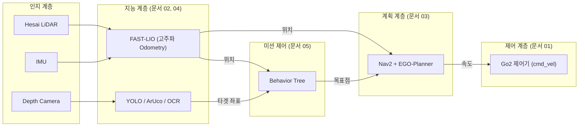

---

## 3. 개발자 가이드 인덱스 (Index)

본 블루프린트를 구성하는 6개의 상세 기술 보고서 라인업입니다. 각 문서는 독립적이면서도 서로 강력하게 의존하며 로봇 시스템을 완성합니다.

* [01] ROS 2 아키텍처 및 미들웨어 ([01_ros2_architecture.md](./01_ros2_architecture.md))
  * 대용량 데이터 병목 현상을 뚫기 위한 CycloneDDS 최적화, QoS 튜닝, 그리고 TF2 기반 시공간 동기화의 수학적 기초.
* [02] SLAM 및 상태 추정 ([02_slam_guide.md](./02_slam_guide.md))
  * 4족보행 특유의 지터(Jitter)와 중력 누수 딜레마 극복. FAST-LIO 기반 고주파 Odometry를 통한 모터 제어기 갈증(Starvation) 해결.
* [03] Nav2 및 경로 계획 ([03_nav2_guide.md](./03_nav2_guide.md))
  * 전방위(Holonomic) 이동이 가능한 4족보행 특성을 극대화하는 EGO-Planner 기반 장애물 회피 및 B-Spline 부드러운 궤적 생성 알고리즘.
* [04] 비전 AI 및 3D 기하학 ([04_vision_guide.md](./04_vision_guide.md))
  * RGB-D 카메라의 하드웨어(Active Stereo) 역투영 원리, 3대 비전 태스크(YOLO/ArUco/OCR), 그리고 AI 연산 지연 보정($t_{capture}$).
* [05] 미션 컨트롤 (Behavior Tree) ([05_mission_control_guide.md](./05_mission_control_guide.md))
  * 기존 FSM의 상태 폭발 한계 수학적 분석 및 `RUNNING` 상태를 활용한 실시간 반응형(Reactive) BT 설계 철학.
* [06] 형상 관리 및 협업 파이프라인 ([06_git_management_guide.md](./06_git_management_guide.md))
  * 코드 패키지 물리적 분리(`core/` vs `mission/`)와 GitHub-Flow를 통한 4인 팀의 Git 충돌 완벽 차단 워크플로우.

---
최종 업데이트: 2026-09-22


<div style="page-break-after: always;"></div>


# [기술 보고서] Unitree Go2 기반 4족보행 로봇 ROS 2 아키텍처 및 미들웨어 설계 가이드

문서 목적: 자율주행 4족보행 로봇 시스템 구축을 위한 ROS 2 미들웨어의 핵심 원리, 통신 프로토콜, 하드웨어 연동 구조 및 디버깅 도구에 대한 엔지니어링 가이드라인 제공.
타겟 하드웨어: Unitree Go2 Edu, Hesai XT16 (3D LiDAR), Intel RealSense (RGB-D)

---

## 1. ROS 2 미들웨어 아키텍처 개요

ROS 2(Robot Operating System 2)는 로봇 응용 프로그램 개발을 위한 분산형 통신 미들웨어(Middleware)이다. 기존 단일 중앙 서버 방식(`roscore`)의 한계를 극복하기 위해 통신 표준 규격인 DDS(Data Distribution Service)를 채택하였다.

* 탈중앙화 및 동적 탐색(Dynamic Discovery): 마스터 노드 없이 네트워크 상의 노드들이 멀티캐스트를 통해 서로를 식별하고 P2P(Peer-to-Peer)로 연결을 수립한다.
* 언어 및 플랫폼 독립성: C++(`rclcpp`)과 Python(`rclpy`) 프로세스 간의 심리스(Seamless)한 통신을 지원하며, 동일 시스템 내 고속 통신 확장이 가능하다.

---

## 2. TSAP: 핵심 통신 프리미티브 (Communication Primitives)

ROS 2의 분산 노드 간 데이터 교환은 목적에 따라 T.S.A.P (Topic, Service, Action, Parameter) 4가지 패턴으로 설계된다. 각 패턴의 특성을 이해하고 적재적소에 적용하는 것이 시스템 설계의 핵심이다.

| 패턴 | 통신 방식 | 특징 및 로봇 적용 사례 |
| :--- | :--- | :--- |
| Topic | 비동기 단방향<br/>(Pub/Sub) | 연속적인 스트리밍 데이터 전송에 적합<br/>- *적용*: Hesai 라이다 점군 데이터, 카메라 영상, 로봇의 실시간 관절 상태 및 IMU 데이터 전송. |
| Service | 동기식 양방향<br/>(Req/Res) | 즉각적인 상태 변경 및 1:1 요청-응답에 적합<br/>- *적용*: 센서 캘리브레이션 트리거 발동, 로봇 보행 모드(Walk ↔ Stand) 전환 명령. |
| Action | 비동기 양방향<br/>+ 중간 피드백 | 장시간 소요되는 목표 지향적 작업 및 취소(Preempt) 기능에 적합<br/>- *적용*: 자율주행(Nav2)의 특정 웨이포인트 이동 명령. (이동 중 진행률 피드백 수신 및 중간 취소 가능) |
| Parameter | 상태 변수 유지 | 노드 실행 중 동적 설정 변경(Dynamic Reconfigure)에 적합<br/>- *적용*: 자율주행 시 최대 허용 속도 조정, AI 비전 인식의 신뢰도 임계값(Threshold) 설정. |

---

## 3. 노드 생명주기 관리 (Lifecycle Node)

실제 구동계가 존재하는 로봇 시스템에서는 노드의 무작위적인 실행이 치명적인 하드웨어 충돌을 야기할 수 있다. 이를 방지하기 위해 상태 머신(State Machine) 기반의 Lifecycle Node (관리형 노드) 패턴을 적용한다.

* 상태 전환 프로세스: `Unconfigured` $\rightarrow$ `configure()` $\rightarrow$ `Inactive` $\rightarrow$ `activate()` $\rightarrow$ `Active`
* 설계 원칙: 
  1. 센서 드라이버와 브릿지 노드를 우선 `Inactive` 상태로 대기시켜 하드웨어 초기화 및 메모리 할당을 완료한다.
  2. 시스템 검증이 완료된 시점에 오케스트레이터(Orchestrator)가 일괄적으로 `Active` 상태로 전환하여 데이터를 퍼블리시하고 모터 제어를 시작하도록 설계한다.

---

## 4. 하드웨어 연동 아키텍처: Unitree Go2 통신 브릿지

Unitree Go2는 내부 모션 제어(MPC/WBC)를 위해 ROS가 아닌 자체 SDK(Unitree SDK 2) 기반의 커스텀 통신 규격을 사용한다. 따라서 상위 자율주행 스택(ROS 2)과 하위 보행 제어기 간의 데이터 인터페이스를 담당하는 Bridge Node가 필수적이다.

1. 상태 수신 (Bottom-Up): Go2 내부 센서(IMU, 관절 엔코더) 데이터를 SDK로 읽어와 ROS 2 `Topic`(`/odom`, `/joint_states`)으로 변환 후 퍼블리시.
2. 명령 송신 (Top-Down): Nav2에서 산출된 목표 선속도/각속도(`/cmd_vel`)를 구독하여, Unitree 전용 제어 패킷(`SportMode` API)으로 변환 후 이더넷을 통해 로봇 제어보드로 송신.

---

## 5. 대용량 센서 트래픽 제어 및 QoS 정책

Hesai XT16(고밀도 3D PointCloud) 및 Intel RealSense(고해상도 RGB-D)와 같은 대역폭 집약적 센서를 안정적으로 처리하기 위해 QoS(Quality of Service) 프로파일 튜닝과 고성능 통신 대안 적용이 필수적이다.

### 5.1 QoS 튜닝 및 네트워크 최적화
* QoS 불일치 문제 방지: 일반 명령(`Reliable`)과 달리 센서 스트리밍은 패킷 유실을 허용하더라도 최신 데이터를 지연 없이 수신하는 `Best Effort`로 설정하여 병목을 방지한다.
* 데이터 다운샘플링 및 압축: 라이다 점군은 Voxel Grid Filter를 거쳐 분해능을 낮춰 전송하며, 카메라 원본(Raw) 이미지는 `image_transport`를 통해 압축 스트리밍한다.

### 5.2 대용량 통신 오버헤드 해결을 위한 고급 대안 (Alternative Approaches)
기본 ROS 2 네트워크 통신의 병목을 원천적으로 제거하기 위해 아래와 같은 Zero-Copy 기반 아키텍처를 적용할 수 있다.
* 프로세스 내 Zero-Copy (Intra-process Communication): 
  라이다 노드와 SLAM 노드를 하나의 프로세스 컨테이너(Component)로 묶어 실행한다. 메모리를 복사하지 않고 포인터(`std::unique_ptr`)만 전달하므로 CPU 부하와 지연율이 극적으로 감소한다.
* 공유 메모리 통신 (Shared Memory, e.g., Eclipse Iceoryx): 
  서로 다른 프로세스 간 통신이 불가피할 경우, 네트워크 소켓 대신 커널 수준의 공유 메모리 기반 DDS(예: FastDDS SHM, CycloneDDS + Iceoryx)를 활성화하여 대용량 센서 패킷의 복사 비용을 '0'으로 만든다.

---

## 6. 공간 좌표계 변환 시스템 (TF2)

4족보행 로봇은 다리가 교차하며 움직이므로 몸체(Body)가 지속적으로 롤(Roll)/피치(Pitch) 방향으로 요동친다. 다양한 위치에 마운트된 센서들의 데이터를 하나의 절대적인 기준점(글로벌 맵)으로 정확히 정합하기 위해 TF2 (Transform Library) 시스템을 사용한다. TF2는 단순한 공간 좌표의 3차원 변환뿐만 아니라, '시간(Time)'에 따른 과거 위치 이력까지 추적하는 로봇 아키텍처의 핵심 컴포넌트이다.

### 6.1 핵심 좌표계 구조 (The TF Tree)
로봇 시스템 내의 모든 좌표계는 끊어지지 않는 단일 트리(Tree) 구조로 연결되어야 하며, 끊어질 경우 Nav2와 SLAM이 즉시 동작을 멈춘다.
* `map`: 전역 지도 좌표계 (절대 좌표, SLAM 노드가 계산하여 제공)
* `odom`: 로봇의 누적 주행 궤적 (Go2의 보행 오도메트리와 IMU를 융합하여 계산. 물리적 미끄러짐에 의해 시간이 지남에 따라 오차가 누적됨)
* `base_link`: Unitree Go2 로봇 몸체의 정중앙 기준점
* `lidar_link` / `camera_link`: 로봇 몸체에 부착된 센서들의 물리적 위치

*(데이터 변환 흐름: `map` $\rightarrow$ `odom` $\rightarrow$ `base_link` $\rightarrow$ `lidar_link`)*

### 6.2 정적 변환(Static TF)과 동적 변환(Dynamic TF)
* Static TF (정적 변환): 로봇 조립 시 고정된 센서의 물리적 오프셋이다. 일반적으로 URDF (Unified Robot Description Format)라는 XML 기반 로봇 모델링 파일에 3D CAD 도면 치수(예: base_link 기준 X축으로 +20cm, Z축으로 +15cm)를 기입하면, `robot_state_publisher` 노드가 이를 읽어 시스템 전체에 브로드캐스트한다.
* Dynamic TF (동적 변환): 로봇이 이동함에 따라 10Hz~100Hz 주기로 실시간 갱신되는 좌표계다. 하위 제어기가 산출하는 `odom` $\rightarrow$ `base_link` 간의 변환과, SLAM 노드가 오차를 지속적으로 교정해주는 `map` $\rightarrow$ `odom` 간의 변환이 여기에 속한다.

### 6.3 시공간 동기화 (Spatio-Temporal Synchronization)
Vision AI 엔지니어가 ROS 2 통신에서 가장 흔히 마주하는 에러는 *"Lookup would require extrapolation into the past/future"* 이다. 
* 원리: RealSense 카메라가 1.03초에 타겟을 인식하고 계산을 마친 1.10초 시점에, 로봇 몸체는 이미 다른 위치로 이동해 있다. TF2는 자체 버퍼에 과거 10초간의 로봇 위치 이력을 큐(Queue) 형태로 저장해 둔다.
* 실무 적용: 타겟 좌표를 지도(`map`) 기준으로 변환할 때, 단순히 현재 시간을 넣으면 안 된다. 반드시 이미지 메시지 헤더(`Header`)에 각인된 타임스탬프(1.03초)를 TF2 조회(`lookup_transform`) 함수에 넘겨주어야, 정확히 그 찰나의 로봇 위치를 역산하여 오차 없는 3D 매핑이 가능하다.

---

## 7. ROS 2 검증 및 디버깅 도구 (Introspection & Visualization)

효율적인 알고리즘 개발 및 협업을 위해 다음 3가지 핵심 도구를 적극 활용한다.

### 7.1 RViz2 (3D Visualization Tool)
물리적인 세계의 센서 데이터와 로봇의 상태를 3D 공간에 시각화하는 도구이다.
* 주요 용도: PointCloud2 포인트 형상 확인, TF 좌표계 축 정렬 상태 검증, Nav2의 Costmap 및 Global/Local Path 경로 시각적 확인.

### 7.2 rqt (Qt-based GUI Framework)
시스템의 내부 상태를 분석하고 제어하는 노드 인트로스펙션(Introspection) 도구 모음이다.
* rqt_graph: 현재 실행 중인 모든 노드와 그 사이를 연결하는 TSAP 통신망의 토폴로지를 방향성 그래프로 시각화하여 병목 및 연결 누락을 디버깅한다.
* rqt_tf_tree: TF 좌표계의 부모-자식 트리 구조 및 변환 주기를 확인한다.

### 7.3 ros2 bag (데이터 레코더 및 플레이어) (AI 엔지니어 필수 도구)
센서 스트림과 제어 데이터를 파일(`.db3` 또는 `.mcap`)로 기록하고 정확한 타이밍에 재생하는 도구이다.
* 오프라인 개발 파이프라인: 
  실제 로봇(Go2)을 구동하여 경기장 환경의 Hesai 라이다 및 카메라 데이터를 한 번 `ros2 bag record`로 녹화한다. 이후 팀원들은 하드웨어 없이 각자의 PC에서 `ros2 bag play`로 데이터를 재생(Replay)하며 Vision AI 인식률 테스트 및 SLAM 알고리즘 정밀 튜닝을 병렬적으로 수행할 수 있다.


<div style="page-break-after: always;"></div>


# [기술 보고서] SLAM 이론 기초 및 4족보행 로봇 맞춤형 LIO 파이프라인 설계

문서 목적: 로봇 공학과 SLAM에 입문하는 AI/SW 엔지니어들이 상태 추정(State Estimation)의 수학적 선행 개념과 필터(Filter) 이론을 완벽히 숙지하고, 이를 바탕으로 4족보행 로봇의 보행 지터(Jitter)를 극복하기 위한 최적의 하이브리드 SLAM 아키텍처를 도출함.
타겟 하드웨어: Unitree Go2 Edu, Hesai XT16 (16채널 3D LiDAR), 내장 IMU

---

## 1. 선행 개념: 상태 추정과 센서의 물리적 한계

SLAM(Simultaneous Localization and Mapping)은 근본적으로 "닭과 달걀의 딜레마"를 안고 있습니다. 정확한 지도를 그리려면 로봇의 현재 위치를 알아야 하고, 정확한 위치를 찾으려면 정밀한 지도가 필요하기 때문입니다.

### 1.1 기본 정의 (Definitions)
* Pose (자세, $SE(3)$): 로봇의 현재 상태를 나타내는 6자유도(6-DoF) 변수. 3차원 위치($x, y, z$)와 3차원 방향(Roll, Pitch, Yaw 또는 Quaternion)으로 구성됩니다.
* Point Cloud (점군 데이터): 3D LiDAR가 주변 환경에 레이저를 쏘아 반사되어 돌아온 수십만 개의 $(x, y, z)$ 좌표 집합입니다.

### 1.2 센서의 물리적 한계와 중력 누수(Gravity Leakage)의 딜레마
* IMU의 적분 발산 (Drift): 가속도를 두 번 적분하여 위치를 추정하므로, 미세한 오차가 시간의 제곱($t^2$)에 비례하여 기하급수적으로 폭발합니다.
* 중력 보정(Gravity Compensation)의 치명적 오차: 가속도계는 가만히 있어도 상향 $9.81m/s^2$의 중력을 측정합니다. 순수 이동 가속도를 구하려면 $\mathbf{a}_{true}^B = \mathbf{a}_{raw}^B - \mathbf{R}_W^B \mathbf{g}^W$ 공식을 통해 중력을 빼야 합니다. 만약 로봇의 기울기(Roll/Pitch) 추정치에 단 $0.1^\circ$의 오차만 발생해도, $9.81 \times \sin(0.1^\circ) \approx 0.017 m/s^2$의 가짜 수평 가속도가 새어나옵니다. 이를 10초간 적분하면 제자리에 있어도 0.85m나 미끄러지는 위치 발산이 발생합니다.
* LiDAR의 왜곡 (Motion Skew): 라이다가 1바퀴 도는 100ms 동안 로봇이 이동/진동하면 점군 지형 자체가 찌그러집니다.
* 해결(LIO의 탄생): IMU는 고주파로 궤적을 예측해 라이다 점군을 펴주고(Deskew), 라이다는 저주파 기하학 매칭을 통해 IMU의 기울기 오차를 칼같이 잡아주어 중력 누수를 원천 차단합니다.

### 1.3 센서 샘플링 주기(Sampling Rate)와 로봇 제어 주기(Control Rate)의 불일치 극복

로봇 자율주행 시스템에서는 센서가 현실을 측정하는 빈도(Sampling Rate)와 로봇이 넘어지지 않기 위해 모터에 명령을 내리는 빈도(Control Rate)가 극단적으로 다릅니다.

| 컴포넌트 | 일반적 동작 주기 | 데이터 특성 및 지연(Latency) |
| :--- | :--- | :--- |
| IMU 센서 | 200 ~ 500 Hz | 미세 전자기계(MEMS) 소자. 지연시간 $1 \sim 5 ms$ (초고속) |
| Go2 보행/모터 제어 | 50 ~ 100 Hz | 4족보행 동적 안정성을 위한 최소 필수 주기 ($10 \sim 20 ms$ 간격) |
| LiDAR 센서 | 10 ~ 20 Hz | 물리적 미러 1회전 스캔 시간 소요 ($50 \sim 100 ms$) |

* 제어 주기 결핍 (Starvation) 문제: 4족보행 로봇 제어기는 초당 100번($10ms$) 현재 위치와 속도를 알아야 부드럽게 걷습니다. 하지만 라이다(LiDAR)는 10Hz($100ms$)로 매우 느리게 위치를 알려줍니다. 만약 라이다를 기다리면 로봇은 걷다가 멈칫거리는 'Stop-and-Go' 현상과 함께 균형을 잃고 쓰러집니다.
* 해결 (고주파 Odometry): LIO(LiDAR-Inertial Odometry) 알고리즘은 라이다 매칭 사이클($100ms$) 사이의 빈 공간을 500Hz의 초고속 IMU 데이터로 적분하여 채워 넣습니다. 즉, FAST-LIO는 10Hz가 아닌 IMU와 동일한 200~500Hz의 고주파 오도메트리를 토해내어 로봇 모터 제어기의 '갈증(Starvation)'을 완벽히 해소합니다.

---

## 2. 로봇 공간 좌표계(TF Tree)와 강체 변환 수학

SLAM과 자율주행 파이프라인에서 가장 뼈대가 되는 것은 좌표계 간의 강체 변환(Rigid Body Transformation, $T \in SE(3)$) 수학입니다. 

### 2.1 좌표계 변환의 수학적 관계 ($T_{map}^{base\_link}$)
로봇의 최종 절대 위치는 하위 좌표계 변환 행렬들의 곱으로 산출됩니다.
$$ T_{map}^{base\_link} = T_{map}^{odom} \times T_{odom}^{base\_link} $$

1. $T_{odom}^{base\_link}$ (Odometry 추정분): 
   * 로봇이 켜진 시점을 원점(`odom`)으로 삼고, 연속적인 움직임을 추적합니다. (100Hz 이상 고주파 갱신, 오차 누적됨)
2. $T_{map}^{odom}$ (Localization 추정분): 
   * 글로벌 지도(`map`)와 로봇 위치를 대조하여, 오도메트리에 쌓인 '누적 오차(Drift)만큼의 보상분'을 산출합니다. (1~10Hz 저주파 갱신)

### 2.2 3D SLAM과 2D 자율주행(Nav2)의 연결 고리
3D SLAM이 만든 입체 지도를 2D 기반의 Nav2(Costmap)에서 사용하기 위해서는 투영(Projection) 과정이 필수적입니다.
* PassThrough Filter: Z축 기준으로 로봇의 발목 위(0.15m)부터 머리 높이(0.6m) 사이의 점군만 잘라내어 바닥과 천장 노이즈를 제거합니다.
* 2.5D 투영: 잘라낸 얇은 3D 점군을 `pointcloud_to_laserscan` 노드를 통해 2D 레이저 스캔으로 압축하여 Nav2에 전달합니다.

---

## 3. 상태 추정의 두 축: 필터(Filter)와 그래프(Graph) 이론

SLAM은 본질적으로 노이즈가 낀 센서 데이터를 바탕으로 로봇의 숨겨진 궤적을 추론하는 확률론적 상태 추정 문제입니다. 수학적으로는 과거의 모든 제어 입력 $U$와 관측 데이터 $Z$가 주어졌을 때, 궤적 $X$와 환경 지도 $M$의 결합 사후확률을 최대화하는 과정입니다.
$$P(X_{0:t}, M \mid Z_{1:t}, U_{1:t})$$

### 3.1 필터(Filter) 이론의 진화 (FAST-LIO의 근간)
과거의 상태를 버리고, '직전 상태'와 '현재 센서 값' 단 두 가지만을 이용해 현재 상태를 재귀적으로 갱신하는 접근법입니다.

1. Kalman Filter (KF): 선형 시스템의 최적 추정기.
2. Extended Kalman Filter (EKF): 현실의 비선형 움직임을 테일러 1차 전개(Jacobian)로 선형화.
3. Error-State Kalman Filter (ESKF): 전체 상태를 명목 상태(Nominal)와 아주 작은 오차 상태(Error, $\delta x$)로 분리합니다. 매니폴드 상에서 짐벌락(Gimbal Lock) 없이 선형적인 '오차 상태'만을 추정해 업데이트합니다.
4. Iterated ESKF (IESKF): 최신 LIO 기법으로, 가우스-뉴턴(Gauss-Newton) 최적화처럼 현재 프레임 내에서 여러 번 반복 업데이트해 최적해에 수렴시킵니다.

### 3.2 그래프 최적화 (Graph Optimization) (LIO-SAM의 근간)
"과거부터 지금까지의 나의 모든 핵심 발자취(Keyframe)"를 바라봅니다.
* 비선형 최소제곱법: 로봇의 과거 위치가 노드(Node)가 되고, 센서 관측이 제약 조건(Factor/Edge)이 됩니다. 잔차(Residual)의 제곱합이 최소가 되도록 수백 개의 과거 노드들을 스프링망처럼 한꺼번에 잡아당겨 최적화(Smoothing)합니다.

---

## 4. Odometry vs Localization: 추정 원리의 차이

| 비교 항목 | Odometry (오도메트리) | Localization (위치 추정/보정) |
| :--- | :--- | :--- |
| 수학적 모델 | Dead Reckoning (추측 항법)<br/>$x_t = f(x_{t-1}, u_t) + w_t$ | Observation Model (관측 모델)<br/>$z_t = h(x_t, M) + v_t$ |
| 작동 원리 | 직전 시점 $t-1$의 점군과 현재 점군을 정합 (Scan-to-Scan) | 거대한 사전 정밀 지도 $M$에 현재 센서 스캔을 대조 (Scan-to-Map) |
| 오차 특성 | 무한히 누적됨 (Unbounded Drift) | 일정 범위 내 수렴 (Bounded Error) |
| 연속성 | 끊어짐 없이 매끄러움 (Locally Smooth) | 전역 매칭(NDT, AMCL) 시 순간 도약(Jump) 발생 가능 |

---

## 5. 원리 단에서의 비교: FAST-LIO vs LIO-SAM

### 5.1 직관적 비교 매트릭스
| 비교 항목 | FAST-LIO (FAST-LIO2) | LIO-SAM |
| :--- | :--- | :--- |
| 핵심 백엔드 구조 | IESKF (반복 오차-상태 칼만 필터) | Factor Graph Optimization (iSAM2) |
| 특징점 추출 유무 | 없음 (Raw 점군을 `ikd-Tree`에 직접 매칭) | 필수 (선 모서리 Edge와 평면 Surf 분리) |
| 연산 복잡도 | 매우 가벼움 $O(1)$ (상태 차원 역행렬 트릭) | 보통~무거움 $O(N)$ (그래프 증가에 비례) |
| Loop Closure |  없음 (순수 Odometry 특화) |  기본 탑재 (Scan Context 기반 전역 보정) |
| 16채널(Sparse) 강건성| 비정형 환경에서도 매우 강함 (Raw Point) | 특징점이 부족해 매칭 실패 우려 존재 |

### 5.2 아키텍처 상세
* FAST-LIO2: 선/면 분리 없이 Raw 점군 데이터를 동적 트리인 `ikd-Tree`에 직접 삽입/삭제하며 정합합니다. 칼만 게인 행렬 계산 시 상태 차원($O(n^3)$) 역행렬로 축소 유도하여 연산 시간을 극한으로 단축했습니다.
* LIO-SAM: IMU Preintegration Factor, LiDAR Odometry Factor, Loop Closure Factor를 노드로 엮어 전역 오차를 동시 최적화합니다. 강력한 폐루프 보정으로 완벽한 글로벌 맵 생성이 가능합니다.

---

## 6. 4족보행 로봇 특유의 지터(Jitter) 현상과 정밀 보정

바퀴형 로봇과 달리 Unitree Go2는 걸을 때마다 몸체가 앞뒤좌우로 극심하게 요동칩니다(Rocking). 몸체의 회전(Roll/Pitch)이 쉴 새 없이 변하기 때문에, 앞서 언급한 중력 누수(Gravity Leakage) 현상이 극대화되는 가장 가혹한 환경입니다.

1. 지터의 물리적 원인:
   * Impact Shock: 발바닥 접지 시 15~40Hz의 고주파 충격파 발생 $\rightarrow$ 가속도계 센서 클리핑(Clipping) 및 스파이크.
   * Periodic Rocking: 보행 주기(1.5~3.0Hz)에 따른 심한 동요 $\rightarrow$ 실시간 라이다 스큐(Motion Skew) 및 회전 행렬($\mathbf{R}_W^B$) 계산 지연으로 인한 중력 수평 누수.
2. 발현 현상: 3D 지도 상의 벽면이 10~20cm 두께로 팽창하는 고스트 현상(Ghosting) 및 중력 누수로 인한 Z축 솟구침/수평 미끄러짐 발산.
3. 4단계 정밀 보정 전략:
   * 하드웨어 방진 마운트: 라이다와 로봇 결합부에 고무/TPU 댐퍼를 설계하여, IMU 센서가 측정 한계치를 초과해 데이터가 잘려나가는 클리핑(Clipping)을 1차적으로 차단합니다.
   * IMU LPF (Low Pass Filter): 발 접지 시 발생하는 고주파 타격 진동 대역을 소프트웨어 필터로 억제하여 순수 보행 기구학적 움직임만 남깁니다.
   * 상태 벡터 동시 추정 (FAST-LIO 강점): FAST-LIO의 IESKF는 [위치, 속도, 자세, IMU Bias] 뿐만 아니라 [중력 벡터 $\mathbf{g}$] 자체를 상태 변수에 포함시킵니다. 나노초 타임스탬프를 이용해 요동치는 찰나의 기울기를 라이다 평면 매칭과 함께 실시간으로 최적화하여 중력 누수를 틀어막습니다.
   * 보행 기구학 융합 (ZUPT 등): Go2 SDK에서 제공하는 다리 접지 상태(Foot Contact) 정보를 결합하여, 발이 땅에 닿은 순간 속도 오차를 강제로 억제하는 제어 공학적 트릭을 적용할 수 있습니다.

---

## 7. 제안: [LIO-SAM 매핑 + FAST-LIO 로컬라이제이션] 하이브리드 아키텍처

위의 알고리즘 원리를 바탕으로 4족보행 로봇 대회를 위한 강력한 투-트랙(Two-Track) 파이프라인을 제안합니다.

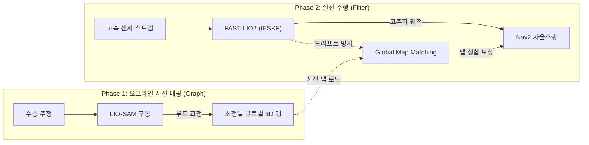

### 7.1 Phase 1 (지도 생성 - LIO-SAM)
* 목표: 닫힌 루프(Closed-Loop)를 통한 기하학적으로 완벽한 전역 지도(Prior Map) 구축.
* 전략: 대회 전 환경 조사 시 천천히 이동하며 LIO-SAM을 구동. 과거 궤적을 통째로 보정하는 Factor Graph의 힘을 빌려 고품질 Point Cloud Map 생성.

### 7.2 Phase 2 (실전 주행 - FAST-LIO + NDT/ICP)
* 목표: 4족보행 진동에 견디는 초고속 오도메트리 확보 및 온보드 CPU 자원 절약.
* 전략: 실전 런(Run)에서는 LIO-SAM의 무거운 최적화를 끄고 IESKF 기반의 FAST-LIO2로 고주파 오도메트리를 산출함. 이 궤적을 사전에 만든 정밀 맵에 겹쳐 맞추는 위치 보정(Localization) 노드와 결합하여 자율주행(Nav2) 수행.


<div style="page-break-after: always;"></div>


# [기술 보고서] 자율 로봇 경로 계획 이론: 이산 탐색(A*)부터 연속 궤적 최적화(EGO-Planner) 및 B-Spline Policy까지

문서 목적: 단순한 프레임워크 사용법을 넘어, 자율 이동 로봇의 핵심인 경로 계획(Path Planning)의 수학적 기초(A*)부터 실시간 연속 궤적 최적화(EGO-Planner), 그리고 최신 AI 모션 제어 기법인 B-Spline Flow Policy(ABPolicy)까지 이론적 메커니즘을 심층 분석함.
타겟 플랫폼: 4족보행 로봇(Unitree Go2) 및 고속 동적 환경

---

## 1. 경로 계획(Path Planning)의 계층적 패러다임

로봇의 자율 이동은 단일 알고리즘으로 해결되지 않으며, 계산 복잡도와 동역학적 한계를 고려하여 전역 기하학적 경로 탐색과 지역 연속 궤적 최적화의 2단계 파이프라인으로 구성됩니다.

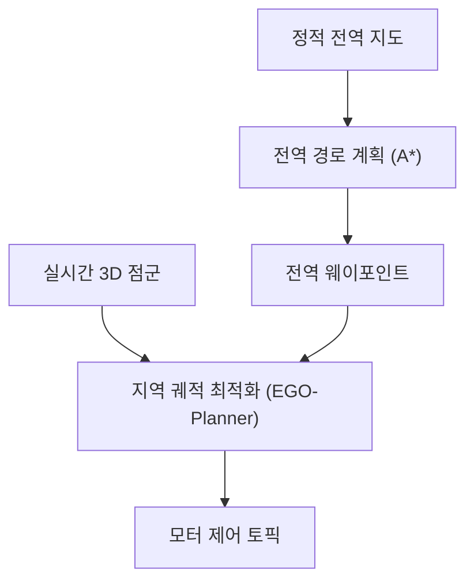

---

## 2. 전역 이산 탐색의 수학적 기초: A* (A-Star) 알고리즘

A* 알고리즘은 가중치 그래프 또는 이산 격자 지도(Grid Map)에서 시작 노드 $s$로부터 목표 노드 $g$까지의 최단 경로를 탐색하는 최적 우선 탐색(Best-First Search) 기법입니다.

### 2.1 평가 함수(Evaluation Function) 모델
각 노드 $n$에 대한 총 예상 비용 $f(n)$은 다음과 같이 정의됩니다:
$$ f(n) = g(n) + h(n) $$

* $g(n)$: 시작 노드 $s$에서 현재 노드 $n$까지 도달하는 데 소요된 실제 누적 비용 (Cost-to-come).
* $h(n)$: 현재 노드 $n$에서 목표 노드 $g$까지의 추정 휴리스틱 비용 (Heuristic, Cost-to-go). (예: 유클리드 거리 또는 맨해튼 거리)

### 2.2 최적성(Optimality)과 휴리스틱의 조건
A*가 수학적으로 항상 최단 경로를 보장(Admissible)하기 위해서는 휴리스틱 함수가 다음 조건을 만족해야 합니다:
1. 허용성 (Admissibility): 휴리스틱 추정치 $h(n)$이 실제 목표까지의 최적 비용 $h^*(n)$보다 결코 과대평가되지 않아야 함 ($h(n) \le h^*(n)$).
2. 일관성 (Consistency / Monotonicity): 임의의 인접 노드 $n, n'$에 대해 삼각부등식을 만족해야 함 ($h(n) \le c(n, n') + h(n')$).

### 2.3 한계점 (로봇 적용 시의 문제점)
* 격자(Grid) 단위로 경로가 꺾여 곡률(Curvature)이 불연속적입니다.
* 로봇의 물리적 한계(최대 가속도, 각속도, 모터 저크(Jerk))를 전혀 고려하지 못하므로, 실제 로봇이 이 경로를 그대로 추종하면 급격한 감속과 심한 보행 진동이 발생합니다. $\rightarrow$ 연속 궤적 최적화의 필요성 대두

---

## 3. B-Spline 곡선의 수학적 특성과 로봇 궤적 표현

로봇 공학에서 부드럽고 물리적으로 실행 가능한 궤적을 표현하기 위해 가장 널리 쓰이는 수학적 도구가 B-Spline(기저 스플라인)입니다.

### 3.1 B-Spline의 정의
$p$차수(Degree $p$) B-Spline 곡선 $s(t)$는 $N+1$개의 제어점(Control Points) $\mathbf{P} = \{c_0, c_1, \dots, c_N\}$과 매듭 벡터(Knot Vector) $\mathbf{u} = [u_0, u_1, \dots, u_{M}]$의 선형 결합으로 정의됩니다:
$$ s(t) = \sum_{i=0}^{N} c_i N_{i,p}(t) $$
여기서 $N_{i,p}(t)$는 Cox-de Boor 재귀 공식으로 계산되는 $p$차 정규화 기저 함수입니다.

[B-Spline의 3대 핵심 성질]
1. Convex Hull Property (볼록 껍질 성질): 곡선이 제어점들의 볼록 다각형 내부에 완벽히 포함됩니다. 제어점만 장애물 밖에 두면 곡선 충돌 검사 비용이 급감합니다.
2. Local Support (국소 지지 성질): 하나의 제어점을 이동해도 곡선의 일부 구간만 변형됩니다. 궤적 전체를 재계산하지 않고 충돌 부위만 실시간 수정이 가능합니다.
3. 고차 미분 연속성: 3차 B-Spline은 가속도까지 연속입니다. 모터 가속도와 저크 폭발을 물리적으로 원천 차단합니다.

---

## 4. 국소 궤적 최적화의 혁신: EGO-Planner (ESDF-Free Gradient-based Planner)

기존의 경사 기반(Gradient-based) 로컬 플래너(CHOMP, Fast-Planner 등)는 장애물 회피를 위해 공간 전체의 거리 정보를 담은 ESDF (Euclidean Signed Distance Field)를 사전에 계산해야 했습니다. 하지만 3D 라이다 환경에서 ESDF를 실시간 업데이트하는 것은 엄청난 CPU 연산 낭비였습니다.

EGO-Planner는 ESDF 구축을 완전히 배제하고, 충돌하는 B-Spline 제어점(Control Point)에 대해서만 국소적인 가상 반발 벡터를 동적으로 생성하고 합산하여 실시간 궤적을 최적화합니다.

[EGO-Planner 실시간 궤적 최적화 프로세스]
1. 충돌 감지: 장애물에 걸친 초기 B-Spline 제어점 식별
2. 앵커 탐색: 장애물 표면의 앵커 포인트 탐색
3. 방향 투영: 밀어낼 단위 방향 벡터 투영
4. 반발력 합산: 다중 장애물 반발 그래디언트 합산
5. 궤적 최적화: L-BFGS 최적화 (Smoothness + Collision + Dynamic)
6. 최종 배포: 충돌 없는 매끄러운 고속 궤적 배포

### 4.1 EGO-Planner의 최적화 목적 함수
EGO-Planner는 B-Spline 제어점 집합 $\mathbf{P} = \{\mathbf{p}_0, \mathbf{p}_1, \dots, \mathbf{p}_N\}$를 최적화 변수로 하여 다음 비용 함수를 최소화합니다:
$$ \min_{\mathbf{P}} J = J_{smoothness} + \lambda_c J_{collision} + \lambda_d J_{dynamic} $$

* 평활도 비용 ($J_{smoothness}$): 궤적의 가속도/저크 미분 에너지를 제어점 간 유한 차분으로 근사하여 모터의 급격한 움직임을 방지.
* 동역학 비용 ($J_{dynamic}$): 로봇의 최대 속도($v_{max}$) 및 가속도($a_{max}$) 물리 한계를 초과하는 제어점에 페널티 부여.

---

### 4.2 ESDF-Free 메커니즘: 앵커 포인트와 벡터 투영 (Projection)
제어점 $\mathbf{p}_i$가 장애물 내부로 침범하거나 안전 반경 $r_j$ 내로 진입했을 때, 알고리즘은 다음 수학적 모델을 통해 반발력을 구성합니다:

1. 앵커 포인트 ($\mathbf{p}_{ij}$): 제어점 $\mathbf{p}_i$에 대응하는 장애물 표면 상의 최근접 점(Anchor Point)을 탐색합니다.
2. 반발 방향 단위 벡터 ($\mathbf{v}_{ij}$): 장애물 표면에서 제어점을 향해 바깥으로 밀어내는 단위 법선 벡터를 정의합니다:
   $$ \mathbf{v}_{ij} = \frac{\mathbf{p}_i - \mathbf{p}_{ij}}{\|\mathbf{p}_i - \mathbf{p}_{ij}\|} $$
3. 투영된 유효 부호 거리 ($d_{ij}$):
   $$ d_{ij} = (\mathbf{p}_i - \mathbf{p}_{ij}) \cdot \mathbf{v}_{ij} $$
   * $d_{ij} < 0$: 제어점이 장애물 내부에 완전히 파묻혀 있음
   * $0 \le d_{ij} < r_j$: 장애물 표면 밖이지만 안전 마진($r_j$) 이내로 위험함
   * $d_{ij} \ge r_j$: 안전 영역 (비용 = 0)

---

### 4.3 장애물 반발력의 다중 합산(Accumulation) 메커니즘

하나의 제어점 $\mathbf{p}_i$가 여러 장애물 사이에 끼어 있거나 복잡한 협곡(Corridor)을 지날 때, 비용과 그래디언트는 인접한 모든 장애물 표면 $j \in \mathcal{O}$에 대해 독립적으로 계산되어 합산됩니다.

#### (1) 충돌 비용 함수 (Cubic Penalty Function)
$$ j_c(\mathbf{p}_i) = \sum_{j \in \mathcal{O}} \max(r_j - d_{ij}, 0)^3 $$
* *설계 이유*: 3승(Cubic) 페널티 함수를 채택함으로써, 안전 경계면($d_{ij} = r_j$)에서 비용 함수가 2차 도함수($C^2$)까지 매끄럽게 연속되어 L-BFGS 수치 최적화의 수렴 속도를 극대화합니다.

#### (2) 경사도(Gradient)의 벡터 합산
최적화기가 제어점을 실제로 밀어내는 합성 그래디언트는 각 장애물이 가하는 반발 벡터들의 가중 벡터합으로 도출됩니다:
$$ \nabla_{\mathbf{p}_i} j_c = \sum_{j \in \mathcal{O}} \left( -3 \cdot \max(r_j - d_{ij}, 0)^2 \cdot \mathbf{v}_{ij} \right) $$

* 양방향 벽면 협곡에서의 자연스러운 수렴:
  로봇의 좌측 벽(장애물 A)과 우측 벽(장애물 B)이 동시에 존재할 경우, 좌측에서 밀어내는 벡터 $\mathbf{v}_{iA}$와 우측에서 밀어내는 벡터 $\mathbf{v}_{iB}$가 그래디언트 단에서 벡터적으로 합산됩니다. 그 결과, 최적화기는 복잡한 전역 탐색 없이도 제어점을 양 벽의 정확한 정중앙(Equidistant Centerline)으로 자연스럽게 밀어 넣어 안전성을 확보합니다.

---

### 4.4 반복적 궤적 갱신 (Iterative Refinement Loop)
1. L-BFGS 최적화기가 합산된 그래디언트 $\nabla_{\mathbf{p}_i} j_c$ 방향을 따라 제어점들을 장애물 밖으로 밀어냅니다.
2. 제어점이 이동함에 따라 새로운 앵커 포인트($\mathbf{p}_{ij}$)와 반발 벡터($\mathbf{v}_{ij}$)가 실시간으로 재계산되어 벡터 필드가 갱신됩니다.
3. 밀려난 제어점이 새로운 장애물과 충돌하면 즉시 새로운 반발 벡터가 합산 리스트에 동적으로 추가되어, 궤적이 미끄러지듯(Gliding) 다중 장애물 틈새를 고속으로 빠져나가게 됩니다.

---

## 5. 최신 AI 기반 궤적 제어: B-Spline Policy (ABPolicy)

최근 로봇 공학 및 인공지능 분야(Imitation Learning / Flow Matching)에서는 행동(Action)을 어떻게 표현하고 제어할 것인가가 최대 화두입니다. 최신 연구인 ABPolicy (arXiv:2602.23901v1, 2026)는 B-Spline 이론을 딥러닝 정책(Policy)과 결합하여 실시간성과 매끄러움을 극대화했습니다.

### 5.1 기존 행동 청킹(Action Chunking / Diffusion Policy)의 치명적 한계
* Intra-chunk Jitter: AI 모델이 원시(Raw) 액션 시퀀스를 직접 출력하면 모터에 고주파 미세 떨림(Jitter)이 발생.
* Inter-chunk Discontinuity: 신경망 추론 주기마다 새로운 행동 청크가 실행될 때, 이전 청크의 끝점과 새 청크의 시작점 사이에 속도/가속도 불연속(Jerk) 발생.
* Stop-and-Go: 동기식(Synchronous) 추론 구조로 인해 모델이 생각하는 동안 로봇이 멈칫거림.

### 5.2 ABPolicy의 해결 아키텍처

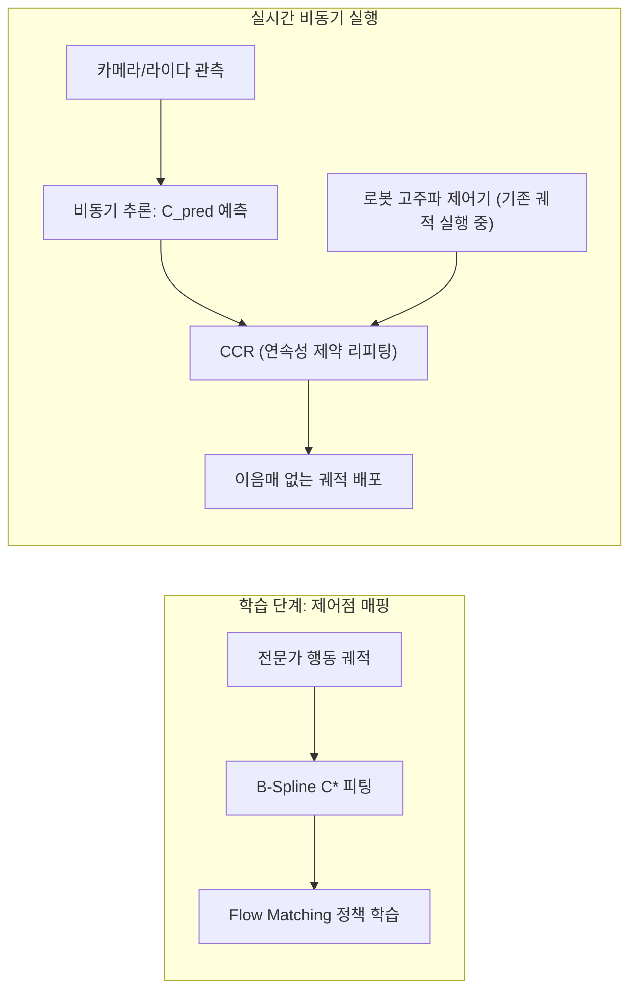

1. B-Spline 제어점 공간에서의 Flow Matching:
   * 네트워크가 초당 수십 개의 이산 액션을 찍어내는 대신, 부드러움이 수학적으로 보장된 B-Spline 제어점($C^*$)의 확률 벡터장을 학습합니다.
2. 연속성 제약 리피팅 (CCR: Continuity-Constrained Refitting):
   * 추론 지연 시간 동안 로봇은 이전 궤적을 계속 실행하고 있습니다.
   * 새 궤적이 도착했을 때, B-Spline의 국소 지지(Local Support) 성질을 활용하여 이미 실행된 궤적과 맞닿는 앞쪽 $N_{free}$개의 제어점만을 최소제곱법(Least-Squares)으로 즉시 리피팅(Refitting)하여 연결 부위의 불연속성을 완벽히 제거합니다.

---

## 6. 4족보행 로봇(Unitree Go2) 실무 적용 시사점

1. 하이브리드 네비게이션 파이프라인 구성:
   * 글로벌 레벨: A* 또는 Hybrid A*를 사용하여 복잡한 경기장의 미로와 벽면을 가로지르는 전역 토폴로지 경로를 산출.
   * 로컬 레벨: Nav2 기본 컨트롤러(DWB)의 단순 반응형 한계를 넘어, EGO-Planner의 B-Spline 최적화를 접목하여 갑작스런 장애물을 만나도 감속 없이 3차원 유연 곡선으로 회피.
2. AI 미션 제어 연계:
   * 팀원들이 Vision AI나 모바일 조작(Manipulation) 모델을 적용할 때, 날것의 속도 명령을 주입하지 않고 B-Spline 기반 액션 파라미터화(ABPolicy 방식)를 채택함으로써 4족보행 로봇 관절 모터의 진동과 과열을 방지할 수 있습니다.


<div style="page-break-after: always;"></div>


# [기술 보고서] 비전 3총사(YOLO·ArUco·OCR)와 샘플링·제어 주기 비동기 아키텍처

문서 목적: 로봇 비전의 3대 핵심 도구(YOLO, ArUco 마커, OCR)의 본질적 역할과 차이점을 명확히 정의하고, 센서의 '샘플링 주기'와 로봇의 '제어 주기' 간 불일치를 해결하는 실시간 소프트웨어 아키텍처를 정립함.
타겟 하드웨어: Intel RealSense (RGB-D 뎁스 카메라), Unitree Go2 Edu, 온보드 GPU

---

## 1. 비전 3총사: YOLO, ArUco, OCR은 각각 무엇을 하는가?

로봇이 눈(카메라)으로 세상을 바라볼 때, 목적에 따라 완전히 다른 3가지 도구를 적재적소에 사용해야 합니다.

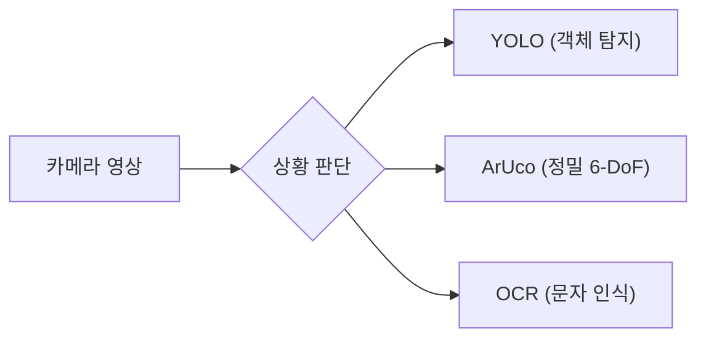

### 1.1 YOLO (You Only Look Once): 범용 객체 탐지
* 한 줄 요약: "화면 안에 어떤 물체(Class)가 어디쯤에 있는가?"를 딥러닝으로 찾아내는 도구.
* 입력 / 출력:
  * 입력: 2D RGB 컬러 영상.
  * 출력: 물체의 이름(Class: `box`, `person`), 확신도(Confidence: 0.95), 2D 바운딩 박스(Bounding Box: $u, v, w, h$).
* 로봇에서의 역할: 넓은 공간을 탐색하며 대략적인 목표물의 위치를 탐지하는 '수색병' 역할. 
  * *실전 예시*: "방 안을 돌아다니며 쓰러진 사람이나 미션용 상자를 찾아라." $\rightarrow$ Bounding Box 중앙에 Depth 카메라 값을 매칭해 대략적인 3차원 좌표 $(X, Y, Z)$를 얻어 Nav2의 이동 목표점으로 넘겨줍니다.

### 1.2 ArUco 마커: 초정밀 6-DoF 자세(Pose) 추정
* 한 줄 요약: "밀리미터(mm) 단위로 정확하게 몇도 틀어져 있는가?"를 기하학으로 풀어내는 도구.
* 입력 / 출력:
  * 입력: 흑백 격자무늬 정사각형 마커 영상.
  * 출력: 카메라와 마커 사이의 3차원 상대 위치 변위($x, y, z$)와 3차원 회전 각도($Roll, Pitch, Yaw$) 행렬 ($SE(3)$).
* 로봇에서의 역할: 로봇이 특정 장소에 딱 맞춰 몸을 밀어 넣어야 하는 '정밀 유도 장치' 역할.
  * *원리 (`cv::solvePnP`)*: 마커의 실제 규격(예: 가로세로 10cm)을 알고 있으므로, AI 추론 없이 순수 투영 기하학 계산만으로 0.1도 단위의 오차까지 계산합니다.
  * *실전 예시*: 무선 충전 패드에 안착하기, 좁은 게이트 정중앙으로 통과하기, 로봇 팔로 집을 목표물의 정확한 착지점 파악.

### 1.3 OCR (Optical Character Recognition): 광학 문자 인식
* 한 줄 요약: "벽이나 사물에 적힌 글자/숫자가 무엇인가?"를 읽어내는 도구.
* 입력 / 출력:
  * 입력: 텍스트가 포함된 이미지 영역.
  * 출력: 텍스트 문자열(String: `"ROOM 101"`, `"GOAL B"`).
* 로봇에서의 역할: 인간을 위해 설치된 시각 정보를 판독하는 '통역사' 역할.
  * *실전 파이프라인*: 텍스트 영역 검출(Detection) $\rightarrow$ 글자 인식(Recognition) $\rightarrow$ Depth 카메라로 해당 글자가 쓰인 벽면의 3차원 위치를 측정하여 지도에 마커 등록.
  * *실전 예시*: "3번 구역으로 가라", "비상구 표지판을 읽고 대피하라".

---

## 2. AI 비전 처리 지연(Latency)과 시공간 왜곡 극복

카메라 센서가 이미지를 찍어내는 속도와, 무거운 AI 모델이 이를 분석하는 속도는 근본적으로 다릅니다. 이 주기(Rate) 불일치를 소프트웨어적으로 해결하지 못하면 로봇은 엉뚱한 곳을 향해 움직이게 됩니다.

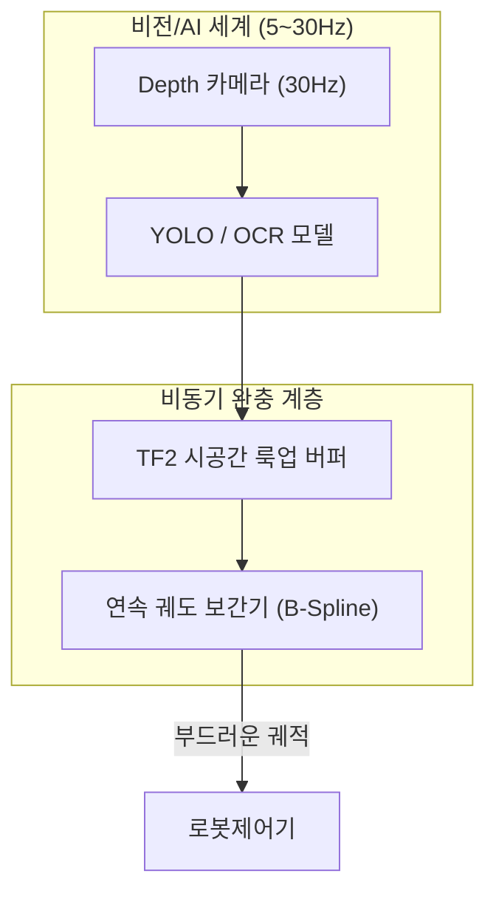

### 2.1 대용량 스트림 및 AI 추론 주기 비교

| 컴포넌트 | 일반적 주기 | 데이터 특성 및 오버헤드 |
| :--- | :--- | :--- |
| Depth 카메라 스트림 | 15 ~ 30 Hz | 비압축 컬러+깊이 스트림 (프레임당 수 MB $\rightarrow$ 초당 100MB+) |
| AI 비전 모델 (YOLO/OCR)| 5 ~ 15 Hz | 온보드 GPU 심층 신경망 연산 부하 ($70 \sim 150 ms$의 극심한 추론 딜레이) |

* 큐(Queue) 지연 방지: AI 연산 속도(10Hz)가 카메라 수신 속도(30Hz)보다 느릴 때 버퍼에 과거 프레임을 쌓아두면 지연이 눈덩이처럼 불어납니다. ROS 2 구독자 설정에서 `KeepLast(1)`을 적용하여, 과거 프레임은 버리고 항상 최신 프레임만 추론하는 정책(Latest-Frame)을 필수 적용해야 합니다.

### 2.2 시간 지연에 따른 위치 왜곡 (Spatial Misalignment) 해결

* 문제 발생 상황: AI 모델이 타겟 상자를 인식하는 데 $100ms$가 걸렸습니다. 4족보행 로봇이 $1.0m/s$의 속도로 달리고 있다면, AI가 "상자 찾았다!"라고 확정한 순간 로봇은 이미 $10cm$ 앞으로 전진해 있습니다. 이때 '현재 시점'의 로봇 위치를 기준으로 상자 좌표를 계산하면 10cm 오차가 발생해 엉뚱한 허공을 목표점으로 찍게 됩니다.
*  해결책: 타임스탬프 기반 TF2 과거 버퍼 역추적
  1. 이미지가 카메라 센서에 찍힌 정확한 물리적 시점 $t_{capture}$를 이미지 메시지 헤더(`std_msgs/Header`)에 기록하여 넘깁니다.
  2. AI 추론이 $100ms$ 뒤에 끝나더라도, 3D 좌표 변환을 할 때는 $t_{now}$가 아니라 $t_{capture}$ 시점의 TF 트리를 과거 버퍼에서 소급 조회하여 계산합니다:
  $$ \mathbf{P}_{map} = T_{map}^{camera}(t_{capture}) \times \mathbf{P}_{camera} $$
  이 기법을 통해 AI 추론 지연이 아무리 길어져도 로봇의 이동에 따른 공간 왜곡을 100% 보정할 수 있습니다.

---

## 3. RGB-D 뎁스 카메라의 작동 원리와 3D 점군 생성

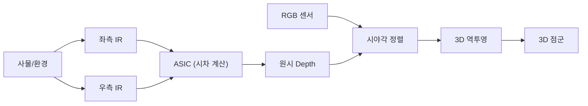

1. Active IR Stereo 원리:
   * 좌/우 적외선 카메라의 시차(Disparity, $d$)와 기선 거리(Baseline, $B$)를 이용해 깊이 $Z = \frac{f \cdot B}{d}$를 하드웨어 ASIC에서 실시간 도출합니다.
   * 무늬가 없는 단색 벽면에서도 IR 프로젝터가 인공 격자를 쏴주므로 거리를 측정할 수 있습니다.
2. RGB-Depth 시야각 정렬 (Alignment):
   * 컬러 렌즈와 깊이 렌즈의 위치 차이를 소프트웨어적으로 보정하여, RGB 이미지의 $(u, v)$ 픽셀과 Depth 이미지의 $(u, v)$ 픽셀을 1:1로 일치시킵니다 (`align_depth_to_color`).
3. 3D 역투영 (Deprojection):
   * 정렬된 영상에서 AI가 지정한 픽셀 $(u, v)$와 깊이 $Z$를 미터 단위의 3차원 좌표 $(X_c, Y_c, Z_c)$로 변환합니다:
     $$ X_c = \frac{(u - c_x) \cdot Z}{f_x}, \quad Y_c = \frac{(v - c_y) \cdot Z}{f_y}, \quad Z_c = Z $$

---

## 4. 뎁스 노이즈 필터링 전략

* 가운데 관통 현상: Bounding Box 중심 픽셀이 물체 뒤쪽의 먼 벽면을 찍는 에러.
* 해결 (DBSCAN / Median): BBox 내부 픽셀들을 모아 3D 공간 상에서 밀도 기반 군집화(DBSCAN)를 수행하여 배경 점들을 털어내고, 실제 전경 물체 점군의 중심점(Centroid)을 계산합니다.

---

## 5. [확장 사항] Visual SLAM 분석과 센서 역할 분담

* Visual SLAM의 한계: 4족보행 로봇의 보행 진동(15~40Hz)으로 인한 모션 블러(Motion Blur)와 롤링 셔터 왜곡으로 인해 특징점 추적이 끊기기 쉽고, GPU 자원을 지나치게 소모합니다.
* 최종 역할 분담:
  * LiDAR (Hesai XT16): 지도 작성 및 위치 추정(SLAM) 100% 전담 (조명과 진동에 무관).
  * Depth 카메라 (RealSense): 화각 내 시맨틱 타겟 인식(YOLO, ArUco, OCR) 및 정밀 도킹 전담.


<div style="page-break-after: always;"></div>


# [기술 보고서] 로봇 미션 제어 이론: FSM에서 Behavior Tree로의 패러다임 전환

문서 목적: 자율주행 로봇의 고수준 의사결정(High-level Decision Making)을 담당하는 미션 컨트롤(Mission Control) 아키텍처의 수학적/논리적 이론을 분석하고, 왜 현대 로봇 공학이 FSM을 버리고 Behavior Tree(BT)를 채택했는지 이론적 근거를 정립함.
주요 대상: Nav2 및 자체 자율 미션 파이프라인을 설계하는 AI/제어 소프트웨어 엔지니어.

---

## 1. 자율 로봇의 의사결정 아키텍처 개요

로봇 시스템은 하위 레벨의 '반사적 제어'(제어 주기 100Hz)부터 상위 레벨의 '인지 및 판단'(제어 주기 1~10Hz)까지 여러 계층으로 나뉩니다.
미션 컨트롤은 인지(Vision/SLAM) $\rightarrow$ 계획(Nav2) $\rightarrow$ 행동(Motor)으로 이어지는 정보 흐름을 오케스트레이션(Orchestration)하는 최상위 '두뇌' 역할을 수행합니다.

이 두뇌를 설계하는 대표적인 두 가지 수학적 모델이 바로 FSM(유한 상태 기계)과 Behavior Tree(비헤이비어 트리)입니다.

---

## 2. FSM (Finite State Machine, 유한 상태 기계) 이론과 한계

### 2.1 FSM의 논리 구조
FSM은 시스템이 가질 수 있는 유한한 상태(States)와, 특정 조건(Event)이 만족되었을 때 다른 상태로 넘어가는 전이(Transitions)로 구성된 방향 그래프(Directed Graph) 모델입니다.

* 수학적 정의: 5튜플 $(S, \Sigma, \delta, s_0, F)$
  * $S$: 유한한 상태 집합 (예: 대기, 이동, 탐색)
  * $\Sigma$: 입력 이벤트 집합 (예: 배터리 부족, 장애물 발견)
  * $\delta$: 전이 함수 ($S \times \Sigma \rightarrow S$)

### 2.2 로봇 공학에서 FSM이 직면하는 치명적 한계: '상태 폭발(State Explosion)'
FSM은 순차적이고 단순한 작업(예: 세탁기, 자판기)에는 완벽하지만, 예측 불가능한 환경을 누비는 자율 로봇에서는 완전히 무너집니다.

1. 상태 폭발(State Explosion): 새로운 상태 $N$을 추가할 때마다, 기존의 모든 상태에서 발생할 수 있는 예외 처리 전이(Transition) 선을 $N^2$ 단위로 연결해 주어야 합니다.
2. 반응성(Reactivity) 부족: '이동 중(Moving)' 상태에서 갑자기 '배터리 부족'이나 '센서 고장' 이벤트가 발생하면, 이를 처리하기 위해 그래프가 거미줄처럼 복잡해집니다.
3. 재사용성 불가: FSM의 각 상태는 특정 전이 조건(Goto 문)과 강하게 결합(Coupling)되어 있어, '이동 모듈'만 떼어내 다른 프로젝트에서 재사용하는 것이 불가능합니다.

---

## 3. Behavior Tree (비헤이비어 트리) 핵심 이론

현대 로봇(특히 Nav2, 로봇 팔 제어)은 FSM의 한계를 극복하기 위해 게임 AI에서 유래한 Behavior Tree(BT)를 표준으로 채택했습니다. 

### 3.1 BT의 근본 철학: `RUNNING` 상태와 틱(Tick)
FSM이 '상태(State)' 중심이라면, BT는 '작업(Task)' 중심의 트리(Tree) 구조입니다.
루트(Root)에서 출발한 실행 신호인 틱(Tick)이 나뭇가지를 타고 리프(Leaf) 노드까지 내려가 작업을 실행하고, 다음 3가지 상태 중 하나를 부모 노드로 반환(Return)합니다.

* `SUCCESS`: 작업이 성공적으로 끝남.
* `FAILURE`: 작업 실패 또는 조건 불만족.
* `RUNNING` (가장 중요): 비동기 작업(예: 로봇의 주행, AI의 긴 추론)이 "아직 진행 중"임을 의미. FSM에는 없는 개념으로, 로봇이 멈추지 않고 계속 제어 루프를 돌 수 있게 해줍니다.

### 3.2 핵심 제어 흐름 노드 (Control Flow Nodes)

BT의 강점은 복잡한 논리를 단 몇 가지의 흐름 노드로 조합(Composition)할 수 있다는 점입니다.

| 노드 기호 | 이름 | 실행 원리 (자식 노드들을 평가하는 방식) | 로봇 활용 예시 |
| :---: | :--- | :--- | :--- |
| `->` | Sequence (순차) | 자식 노드들을 왼쪽에서 오른쪽으로 실행. 하나라도 `FAILURE`면 즉시 `FAILURE` 반환. 모두 `SUCCESS`여야 `SUCCESS`. | "마커 찾기 $\rightarrow$ 문 열기 $\rightarrow$ 진입하기" (논리적 AND) |
| `?` | Fallback/Selector (대안) | 자식들을 순서대로 실행. 하나라도 `SUCCESS`면 즉시 `SUCCESS` 반환. 모두 실패해야 `FAILURE`. | "전역 경로 이동 $\rightarrow$ 실패 시 로컬 회피 $\rightarrow$ 실패 시 원격 제어 요청" (논리적 OR) |
| `=` | Parallel (병렬) | 자식 노드들을 동시에(동일한 틱에) 실행. 지정된 N개의 자식이 성공하면 `SUCCESS`. | "주행(Nav2) 수행" 동시에 "카메라로 장애물 지속 감시" |

---

## 4. BT vs FSM: 패러다임 비교 분석 (모듈성과 반응성)

#### FSM (Goto 로직)
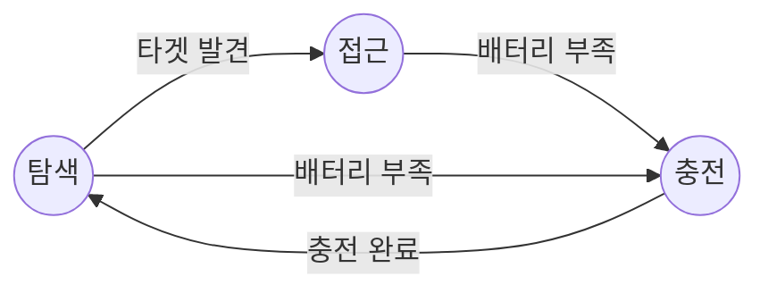

#### Behavior Tree (함수 호출 로직)
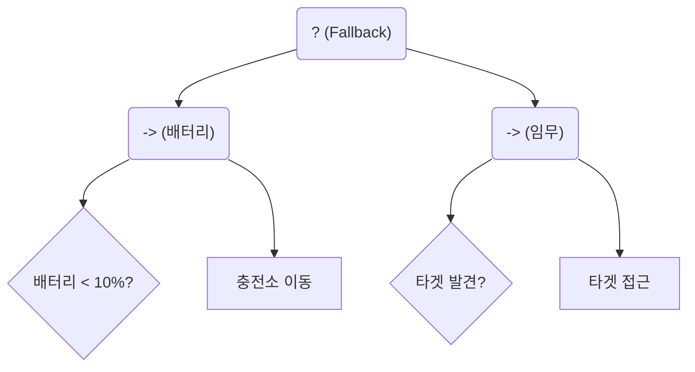

### 4.1 "Goto" 문에서 "Function Call"로의 진화
* FSM은 특정 상태에서 다른 상태로 강제로 넘어가는 프로그래밍의 악명 높은 `goto` 문과 수학적으로 동일합니다. 코드가 스파게티처럼 얽히게 됩니다.
* BT는 노드가 부모에게 결과를 리턴하는 `함수 호출(Function Call)`과 수학적으로 동일합니다. 노드를 독립적인 블록(레고 블록)처럼 취급하여, 복사-붙여넣기로 완벽한 재사용이 가능합니다.

### 4.2 내재된 반응성 (Reactivity)
* 로봇은 주행 중 앞을 가로막는 장애물이나 긴급 정지 명령에 0.1초 만에 반응해야 합니다.
* BT는 `RUNNING` 중인 작업이 있더라도, 트리의 최상단(Root)에서부터 매 주기(예: 10Hz)마다 지속적으로 조건을 재평가(Tick)합니다. 우선순위가 높은 Fallback 노드의 좌측 자식(예: 긴급 회피 조건)이 만족되면, 즉시 우측의 `RUNNING` 노드(주행)를 취소(Halt)시킬 수 있는 '선점형(Preemptive) 반응성'을 기본 탑재하고 있습니다.

---

## 5. 실전 매핑: ROS 2 Action 아키텍처와의 결합

이론적인 BT가 로봇의 물리적 하드웨어로 어떻게 번역될까요? 그 해답은 ROS 2의 액션 서버(Action Server)에 있습니다.

* Tick == Action Goal / Feedback: 
  BT에서 하위 리프(Leaf) 노드(예: `NavigateToPose`)를 Tick 하면, ROS 2 액션 클라이언트가 활성화되어 서버로 Goal을 전송합니다.
* RUNNING == Asynchronous Execution: 
  로봇이 이동하는 수 분 동안 액션 서버는 Feedback을 줍니다. BT 노드는 이를 받아 상위 노드에 `RUNNING`을 리턴하여 제어 권한을 양보(Yield)합니다.
* SUCCESS/FAILURE == Action Result: 
  도착(Result) 시 `SUCCESS`를 반환하며 다음 Sequence 노드로 흐름이 넘어갑니다.

결론적으로, Behavior Tree 이론은 고도로 불확실한 로봇 환경에서 강건성(Robustness), 반응성(Reactivity), 모듈화(Modularity)를 수학적으로 보장하는 유일한 표준 아키텍처입니다.


<div style="page-break-after: always;"></div>


# [기술 보고서] 형상 관리 전략: Git-Flow vs GitHub-Flow 비교 및 로봇 팀 워크플로우 제안

문서 목적: 다수의 인원이 하나의 로봇(하드웨어) 코드를 동시 다발적으로 개발할 때 발생하는 충돌을 방지하기 위해, 대표적인 Git 브랜칭 모델들을 비교 분석하고 4인 규모의 4족보행 로봇 팀에 가장 최적화된 협업 파이프라인을 제안함.

---

## 1. Git과 GitHub의 본질적 차이 및 핵심 개념

협업 시스템을 구축하기 전, 로컬 환경(Git)과 클라우드 플랫폼(GitHub)의 역할적 차이를 명확히 정의해야 합니다.

### 1.1 Git vs GitHub의 개념
* Git (시스템): 로컬 컴퓨팅 환경(개발자 PC 또는 로봇 내장 PC)에 구축되어 소스코드의 파일 변경 이력을 시간순으로 추적하고 제어하는 분산형 버전 관리 시스템(VCS)입니다. 네트워크 연결 없이 독립적으로 작동합니다.
* GitHub (플랫폼): Git 시스템으로 관리되는 로컬 프로젝트(저장소)를 클라우드 서버에 연동하여, 팀원 간의 소스코드 공유, 코드 리뷰(PR), CI/CD 자동화 등을 지원하는 웹 호스팅 협업 플랫폼입니다.

### 1.2 핵심 용어 상세 정의
Git을 단순한 '클라우드 백업소'로 활용할 경우, 모듈 간 의존성이 얽혀 로봇 하드웨어의 오작동을 유발할 수 있습니다. 각 형상 관리 요소는 다음의 관점으로 다뤄져야 합니다.

* 커밋 (Commit): 의미 있는 작업 단위가 기록된 스냅샷(Snapshot)입니다. 코드가 변경된 이력을 고유한 해시(SHA-1) 값, 작성자, 시간과 함께 영구히 기록하며, 치명적인 오류 발생 시 로봇이 정상 동작했던 과거의 특정 커밋으로 정확히 롤백(Rollback)할 수 있는 기준점이 됩니다.
* 브랜치 (Branch): 메인 코드베이스의 무결성을 보호하면서 새로운 알고리즘(AI, SLAM)을 안전하게 테스트할 수 있는 독립된 병렬 개발 환경입니다. 실험이 실패하더라도 메인 코드에 어떠한 영향도 주지 않고 폐기할 수 있습니다.
* 리모트 (Remote): 로컬 Git 저장소와 연결된 온라인 GitHub의 중앙 저장소입니다. 주로 `origin`이라는 식별자로 등록되며 팀원 간 동기화의 중심점 역할을 수행합니다.
* 머지 (Merge): 독립된 브랜치에서 검증이 완료된 작업 내역을 메인 브랜치로 통합하는 병합 과정입니다.
* 충돌 (Conflict): 두 명 이상의 개발자가 동일한 파일의 같은 라인을 동시에 수정하여 병합을 시도할 때 발생하는 시스템 예외 상태입니다. 개발자가 논리적 판단을 거쳐 코드를 취사선택(Resolve)해야 합니다.
* main vs master: 프로젝트의 중심이 되는 기본 브랜치(Default Branch)를 의미합니다. 과거에는 `master`가 주로 사용되었으나, 현재는 소프트웨어 업계 표준에 따라 `main`을 기본 명칭으로 채택합니다.

---

## 2. 브랜칭 모델 비교 분석: Git-Flow vs GitHub-Flow

팀의 개발 속도와 소프트웨어의 안정성을 조율하기 위해 업계 표준으로 활용되는 두 가지 브랜칭 전략을 비교 분석합니다.

### 2.1 Git-Flow (엄격한 릴리즈 기반 버전 관리)
Vincent Driessen이 제안한 모델로, 총 5단계의 브랜치를 엄격하게 분리하여 소프트웨어 라이프사이클을 관리합니다.

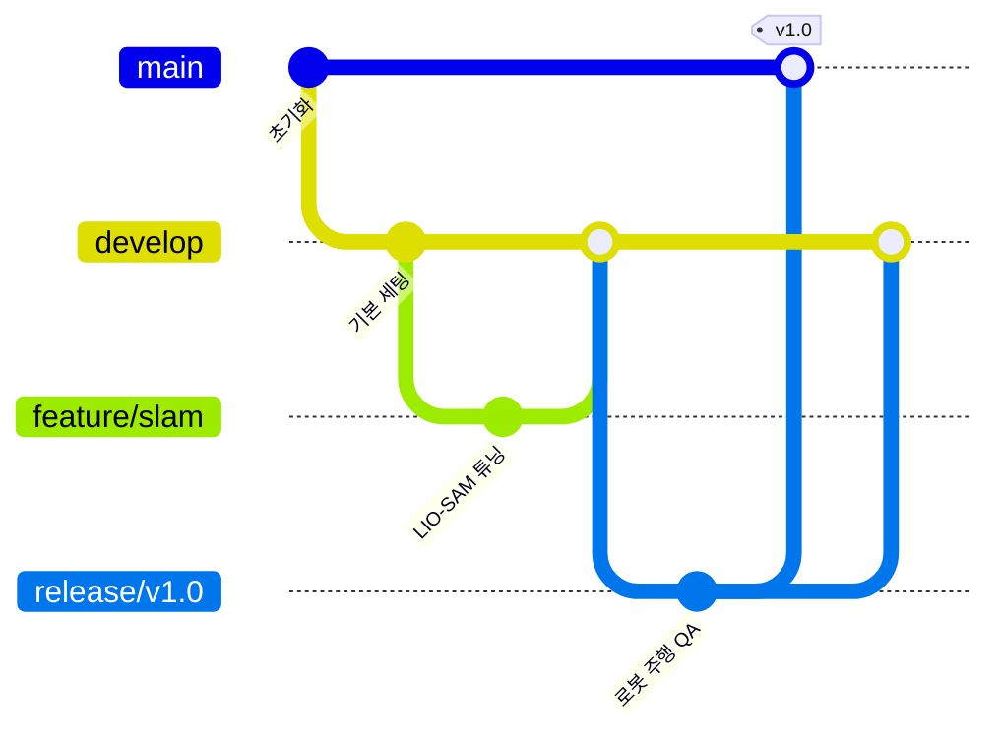

* 구조: `main`, `develop`, `feature`, `release`, `hotfix`
* 흐름: 
  1. 개발자는 `develop` 브랜치에서 `feature` 브랜치를 파생(Checkout)하여 기능을 구현합니다.
  2. 구현이 완료되면 `develop`으로 병합합니다.
  3. 정기 배포 시점에 `develop`에서 `release` 브랜치를 생성하여 QA(품질 검사)를 진행합니다.
  4. 검증이 완료되면 `main`에 최종 병합하고 릴리즈 태그(`v1.0`)를 부여합니다.
* 장점: 메이저/마이너 버전 관리가 명확하며, `main` 브랜치의 안정성이 극도로 보장됩니다. 상용 로봇의 장기 유지보수에 적합합니다.
* 단점: 구조가 복잡하여 브랜치 동기화에 상당한 리소스가 소모됩니다. 필드 테스트 중 파라미터 긴급 수정이 필요할 때 병합 절차가 길어 기민한 대처가 어렵습니다.

### 2.2 GitHub-Flow (애자일 기반 지속적 통합 및 배포)
GitHub에서 창안한 경량화 모델로, 복잡한 중간 브랜치를 배제하고 단일 메인 브랜치를 중심으로 신속한 이터레이션(Iteration)을 수행합니다.

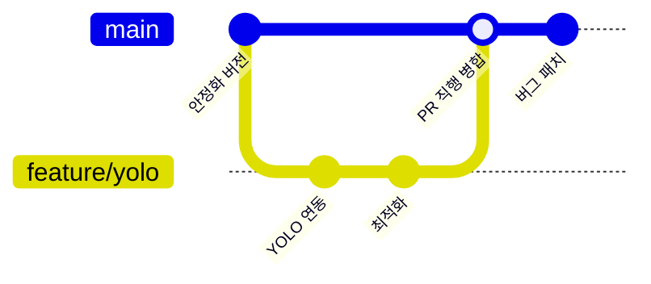

* 구조: `main` + 임시 `feature` 브랜치
* 흐름:
  1. 항상 `main`에서 `feature` 브랜치를 파생하여 기능 개발을 진행합니다.
  2. 작업이 완료되면 Pull Request(PR)를 거쳐 즉시 `main`으로 병합합니다.
* 장점: 워크플로우가 직관적이고 개발된 기능이 즉각적으로 메인에 반영되므로, 빠른 현장 테스트 및 피드백 수용에 최적화되어 있습니다.
* 단점: `main` 병합 전 자체 테스트 및 코드 리뷰 규율이 엄격하지 않을 경우, 결함이 포함된 코드가 로봇 메인 시스템으로 유입되어 치명적 오작동을 유발할 리스크가 존재합니다.

### 2.3 전략 요약 비교표

| 비교 지표 | Git-Flow | GitHub-Flow |
| :--- | :--- | :--- |
| 핵심 철학 | 버전 배포의 무결성 및 안정성 최우선 | 지속적 통합(CI) 및 개발 민첩성 최우선 |
| 병합(Merge) 경로 | `feature` $\rightarrow$ `develop` $\rightarrow$ `release` $\rightarrow$ `main` | `feature` $\rightarrow$ `main` |
| 적합한 프로젝트 | 수개월 주기로 정기 릴리즈를 진행하는 상용 소프트웨어 | 주행 테스트와 수정이 일 단위로 반복되는 연구 개발(R&D) 및 경진대회 |

---

## 3. 4인 로봇 팀을 위한 전략 제안: GitHub-Flow 채택

본 프로젝트의 개발 환경과 팀 구성을 종합적으로 고려할 때, GitHub-Flow 아키텍처를 도입할 것을 제안합니다.

* 도입 근거 1 (프로젝트 성격): 본 프로젝트는 수개월 단위의 정식 납품이 아닌, "경기장에서의 신속한 알고리즘 실험과 즉각적인 미션 달성"이 최우선 목표입니다. 현장(Field)에서 식별된 논리적 결함을 즉시 수정하고 테스트하기 위해 Git-Flow의 무거운 릴리즈 프로세스는 배제하는 것이 합리적입니다.
* 도입 근거 2 (팀 규모): 4인 규모의 팀에서는 동선이 긴 Git-Flow 체계보다, `main`이라는 단일 중심 브랜치를 기반으로 이터레이션을 가속화하는 것이 전체 시스템의 생산성과 하드웨어 대응력 측면에서 압도적으로 우수합니다.

---

## 4. 제안하는 실무 워크플로우 및 충돌 방지 아키텍처

GitHub-Flow를 기반으로, 다수의 엔지니어가 코드 충돌 없이 유기적으로 협업할 수 있는 실무 가이드라인입니다.

### 4.1 브랜치 명명 규칙 (Naming Convention)
고정 브랜치는 오직 `main` 하나만 유지하며, 기능 브랜치는 목적에 따라 접두어(Prefix)를 분리합니다.
* `main`: 실제 로봇 환경에서 무결성 및 정상 동작이 검증된 운영 환경(Production) 코드베이스.
* `core/<기능명>`: SLAM, Nav2, 센서 인터페이스 등 로봇의 기반 기술(Core Tech)을 개발하는 임시 브랜치. (예: `core/fastlio-mapping`)
* `mission/<미션명>`: 대회 개별 과제(장애물 회피, 계단 등반 등)의 행동 트리(BT) 및 제어 시퀀스를 개발하는 임시 브랜치. (예: `mission/delivery-task`)

### 4.2 개발 작업 라이프사이클 (4단계)
1. 분기 (Checkout): 최신 상태의 `main` 브랜치로부터 기능 개발 목적에 부합하는 독립 브랜치를 생성합니다.
2. 개발 및 커밋 (Dev & Commit): 격리된 브랜치 환경에서 기능을 구현하고, 논리적 단위로 명확한 커밋을 기록합니다.
3. 검증 (Verify): 물리 시뮬레이터(Gazebo) 또는 실제 로봇 환경에서 동작 테스트를 수행하여 무결성을 확보합니다.
4. 병합 (Merge): 검증 완료 후 PR을 통해 `main`에 병합하며, 병합이 완료된 임시 브랜치는 즉시 삭제하여 저장소를 청결하게 유지합니다.

### 4.3 모듈 독립성 확보를 통한 충돌(Conflict) 방지 설계
단일 메인 브랜치를 운용하더라도, 서로 다른 파일을 수정하도록 아키텍처를 설계하면 충돌을 원천 차단할 수 있습니다. 이를 위해 ROS 2 워크스페이스 구조를 기능별로 엄격히 물리적 분리합니다.

```text
my_quadruped_ws/src/
├── core/                        # [기반 기술 패키지군 - 엔지니어 A 담당]
│   ├── quadruped_bringup/       # 하드웨어 센서, SDK, 기본 Bringup Launch
│   ├── quadruped_navigation/    # Nav2 파라미터, SLAM 설정 및 프로필
│   └── quadruped_description/   # URDF, 3D 메쉬 파일 (기구학)
│
└── missions/                    # [대회 미션 패키지군 - 엔지니어 B 담당]
    ├── mission_common/          # 공통 인터페이스 (Custom Msg/Srv/Action)
    ├── mission_delivery/        # 배달 미션 전용 제어 노드
    └── mission_stair/           # 계단 등반 미션 전용 제어 노드
```
> 아키텍처 효과: 엔지니어 A가 `missions/mission_delivery`를 구현하고 엔지니어 B가 `core/quadruped_navigation` 파라미터를 동시에 수정하더라도, 소스코드의 디렉토리 경로가 독립되어 있으므로 `main` 병합 시 Git 충돌이 발생하지 않습니다.

---

## 5. Pull Request (PR) 운용 프로토콜

GitHub-Flow 모델의 취약점인 '안전성 결여'를 보완하기 위해 다음과 같은 엄격한 PR 규칙을 적용합니다.

* 표준 개발 프로토콜 (평상시): 
  기능 개발 후 반드시 GitHub에서 PR을 생성해야 하며, 최소 1명 이상의 동료 엔지니어에게 코드 리뷰(Code Review) 및 승인(Approve)을 득한 후 `main`에 병합해야 합니다. 이는 오작동 코드가 로봇 메인 시스템으로 직행하는 것을 차단하는 필수 안전장치입니다.
* 필드 긴급 대응 프로토콜 (대회 당일 예외 규정): 
  현장(Field)에서는 시간적 제약이 극심하므로, 파라미터 튜닝 등의 긴급한 수정 건에 한해 PR 리뷰 절차를 예외적으로 생략하고 로컬 환경에서 `main`으로 직접 병합(Direct Merge) 후 원격 저장소에 Push하는 것을 허용하여 현장 대응력을 극대화합니다.
